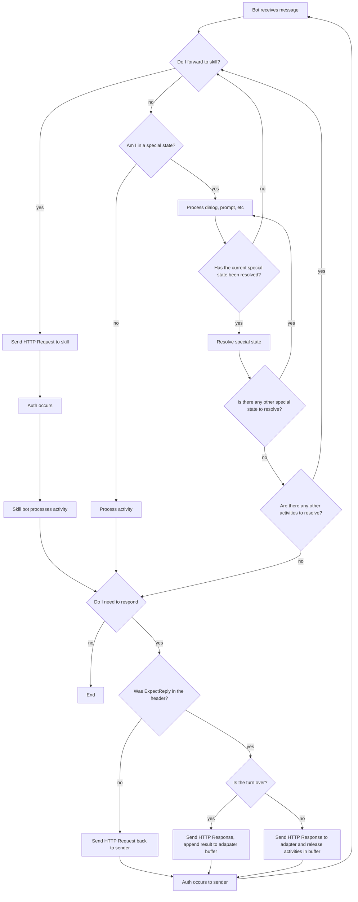

```mermaid
    graph TD
        A[Bot receives message] --> B{Do I forward to skill?}
        B --> |yes| C[Send HTTP Request to skill] 
        B --> |no| D{Am I in a special state?}
        C --> F[Auth occurs]
        F --> G[Skill bot processes activity]
        G --> H{Do I need to respond}
        H --> |no| I[End]
        H --> |yes| J{Was ExpectReply in the header?} 
        J --> |yes| M{Is the turn over?}
        J --> |no| K[Send HTTP Request back to sender]
        K --> L[Auth occurs to sender]
        L --> A
        M --> |yes| N[Send HTTP Response, append result to adapater buffer]
        M --> |no| O[Send HTTP Response to adapter and release activities in buffer]
        N --> L
        O --> L
        D --> |no| P[Process activity]
        D --> |yes| Q[Process dialog, prompt, etc]
        P --> H
        Q --> R{Has the current special state been resolved?}
        R --> |yes| S[Resolve special state]
        R --> |no| B
        S --> T{Is there any other special state to resolve?}
        T --> |yes| Q
        T --> |no| U{Are there any other activities to resolve?}
        U --> |yes| B
        U --> |no| H
```